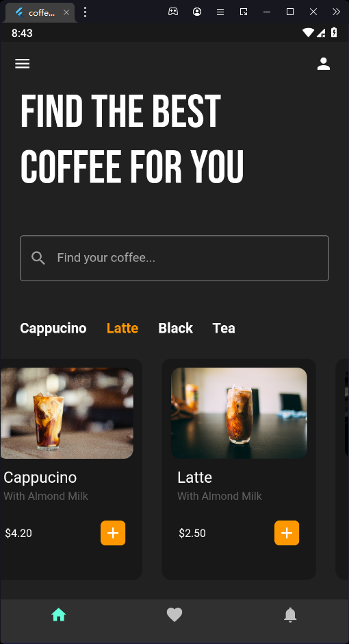

# Flutter Coffee Shop App

This is a simple Coffee shop app built using Flutter.

# Features

    Browse a menu of coffee and other drinks
    Add drinks to cart and place orders
    View order history and track current orders
    Customize drinks with options and add-ons
    Get notifications about order status and delivery updates

# Installation

    Clone the repository: git clone https://github.com/mhmadamrii/Flutter-CoffeeApp.git
    Navigate to the project directory: cd flutter-calculator
    Install the dependencies: flutter pub get
    Run the app: flutter run

# Usage

The design of the app was inspired by modern coffee shops with a minimalist, elegant aesthetic. The color scheme is based on shades of brown and cream, with accents of green and black. The app uses custom icons and typography to create a unique visual identity.

    Voluptate exercitation excepteur ad dolor nostrud id anim nulla amet. Sint id non pariatur esse in voluptate pariatur aute. Anim enim ex pariatur cupidatat excepteur tempor voluptate incididunt. Lorem adipisicing ex tempor ad incididunt elit et irure eu commodo adipisicing. Commodo anim irure aliqua mollit culpa id tempor eiusmod velit in. Dolor excepteur do commodo sint ea fugiat proident incididunt esse.

# This app was built using the following open-source packages:

    flutter
    google_fonts

